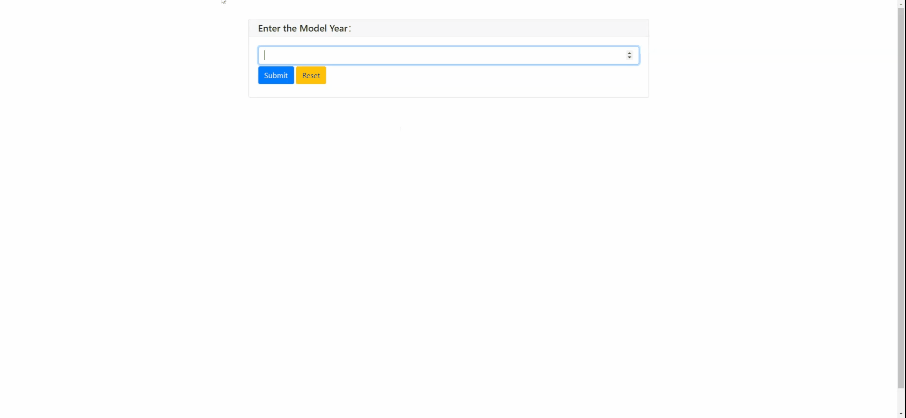

## CarPrice-Prediction-PyWebIO

A PyWebIO application, to predict price of used cars.Here we have used RandomForest Regressor Algorithm to predict/calculate the price of the car.Currently the application is hosted in heroku platform.

### Application Link:
https://carpriceprediction-web.herokuapp.com/

### Setting up:
```
- git clone 
- Create a virtualenv
- pip install -r requirements.txt
- run app.py
```  
### Application Demo:

